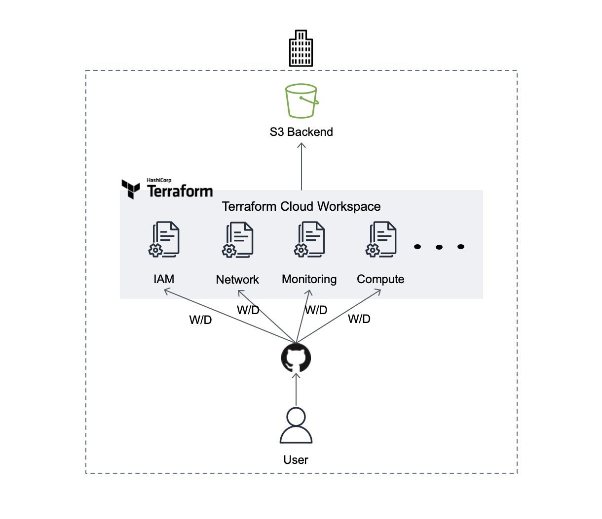

# ldy9037/terraform-aws-starter-package

##### 좋은 commit message 작성을 위한 참고자료

- [commit message 작성 규칙](https://udacity.github.io/git-styleguide/)

## Table of Contents

- [소개](#소개)
- [시작하기](#시작하기)
- [주의사항](#주의사항)
- [참고](#참고)
- [제작자](#제작자)

## 소개

  AWS 계정의 초기 설정들을 쉽게 구성하고 이후에 추가될 리소스들을 쉽게 관리할 수 있도록 확장성을 확보하는 것이 프로젝트의 목표입니다. 이 프로젝트는 조직 규모와 상관없이 적용할 수 있도록 설계되었지만 조직 구성에 따라 일부 구성을 변경해야 할 수 있습니다. 

  
 
 먼저 조직 규모가 작아 AWS를 사용하는 팀이 단일 팀이라면 위처럼 관리하게 됩니다. 한 Repository 내에는 아래와 같은 Resource들이 구성되어 있습니다. 
 - Terraform Cloud의 상태를 관리하는 Backend S3 
 - AWS Resource들을 Working Directory 별로 분류해서 관리하는 Terraform Cloud의 Workspace
 - 관련 Resource끼리 분류(Working Directory)되어 생성된 AWS Resource 

 
 ##### 기술 스택
 - terraform v1.1.7
 - terraform cloud
 - [aws provider](https://registry.terraform.io/providers/hashicorp/aws/latest/docs)

## 시작하기

## 주의사항

## 참고
- [Terraform AWS Provider](https://registry.terraform.io/providers/hashicorp/aws/latest/docs)
- [Terraform tfe Provider](https://registry.terraform.io/providers/hashicorp/tfe/latest/docs)

## 제작자
[ldy9037@naver.com](ldy9037@naver.com)
